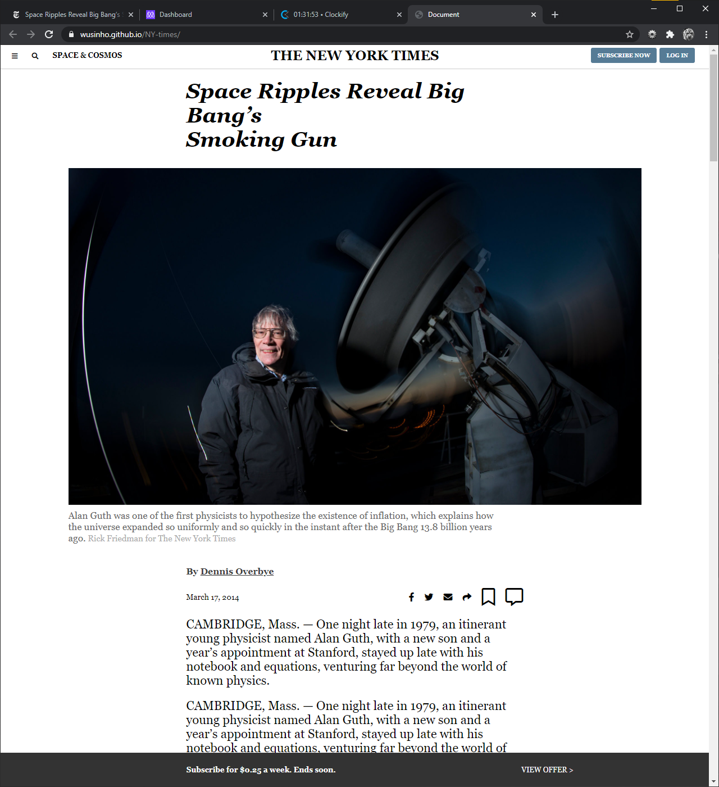

# THE NEW YORK TIMES

This assignment consists of making a clone of a New York Times article page

- Embedding images
- Working with forms
- Floats and positioning
- The box model
- Grid

## Built With

- HTML5 
- CSS
- VSC

## Live Demo

[Live Demo Link](https://wusinho.github.io/NY-times/)

👤 **Author1**

- GitHub: [@githubhandle](https://github.com/githubhandle)
- Twitter: [@twitterhandle](https://twitter.com/twitterhandle)
- LinkedIn: [LinkedIn](https://linkedin.com/linkedinhandle)

👤 **Heber Lazo**

- GitHub: [@Wusinho](https://github.com/Wusinho)

## 🤝 Contributing

Contributions, issues, and feature requests are welcome!

Feel free to check the [issues page](https://github.com/Wusinho/NY-times/issues/).

## Show your support

Give a ⭐️ if you like this project!

## Acknowledgments

- Hat tip to anyone whose code was used
- Inspiration
- etc

## 📝 License

This project is [MIT](LICENSE) licensed.
